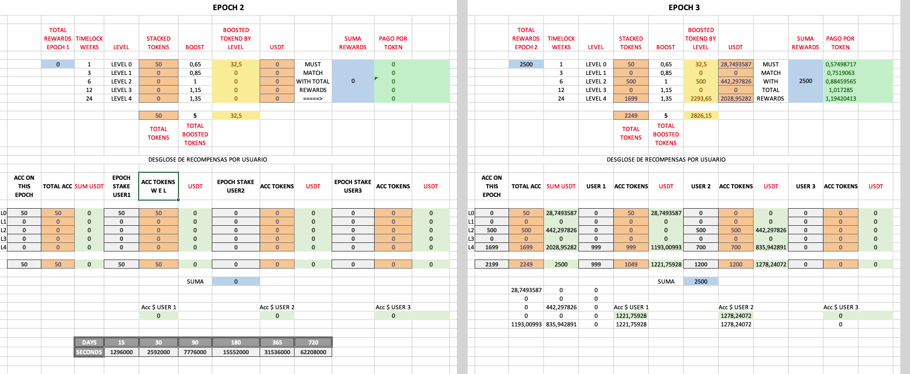
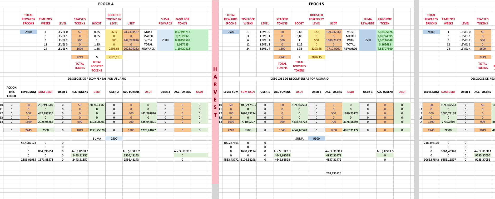
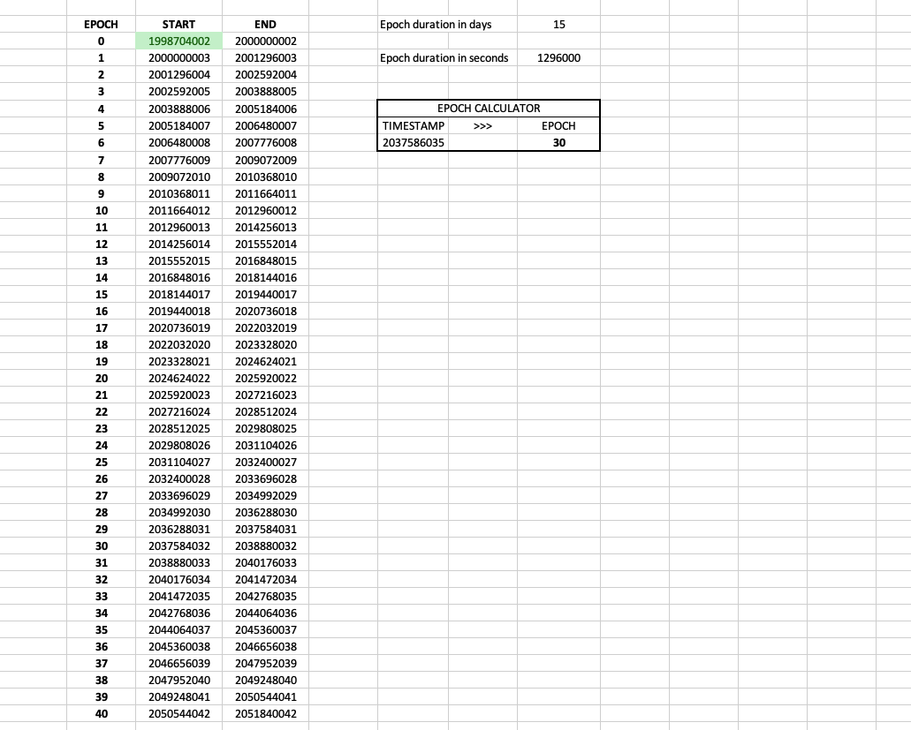
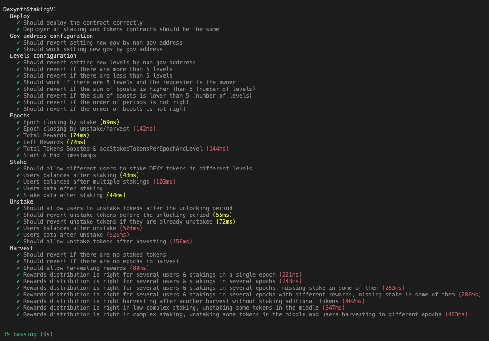

# Dexynth Multilevel Staking

## Project Updates (Dec 2025)

### ⚡️ Gas Optimizations & Refactoring
- **Variable Packaging**: Optimized data types (e.g., `uint40` for timestamps, `uint32` for epochs) and reordered state variables/struct members to pack them into fewer storage slots, significantly reducing storage costs.
- **Custom Errors**: Replaced string revert messages with Custom Errors (e.g., `error StakeStillLocked()`) to save deployment and runtime gas.
- **Explicit Types**: Standardized usage of `uint256` instead of implicit `uint` for clarity and consistency.
- **Visibility Optimization**: Refactored public functions to `external` (`stake`, `unstake`, `harvest`, etc.) to reduce gas costs on function calls.
- **Loop Optimization**: Implemented `unchecked` arithmetic in for-loops to save gas on increment operations.

### 🛠️ Tooling Migration: Hardhat → Foundry
- **Complete Migration**: Replaced Hardhat with **Foundry** for a faster and more robust development environment.
- **Solidity-Native Testing**: Ported all JavaScript tests to Solidity (`DexynthStaking.t.sol`), enabling direct interaction with contracts and faster execution.
- **Improved Testing Infrastructure**:
  - Added `vm.warp` for precise time manipulation in tests.
  - Configured `via_ir = true` for better optimization.
  - Set up Mock ERC20 tokens (`DEXY`, `USDT`) for isolated testing.

---

## Overview

**Dexynth Multilevel Staking** is a staking smart contract for \$DEXY tokens with rewards distributed in $USDT. To ensure the correctness of the staking model and reward logic, the design was first created in an **Excel spreadsheet**, where all calculations were tested under various scenarios. This spreadsheet provided a clear blueprint for the contract implementation and was later validated through a comprehensive **unit test suite** to compare the expected and actual values generated by the contract.

## Key Features

- **Stake and Unstake**: Users can lock $DEXY tokens in the contract and withdraw them after the lock period ends.  
- **Reward Scaling**: Rewards increase based on staking level, incentivizing longer lock durations with higher returns.  
- **Epoch-Based Distribution**: Rewards and staking mechanics are organized into distinct time intervals (epochs).  
- **Administrative Control**: Administrators can add rewards to the pool and adjust contract parameters.

---

## Staking Levels

The contract offers five staking levels, each with different lock periods and reward boosts:

| **Level** | **Lock Period** | **Boost (%)** |
|-----------|-----------------|---------------|
| 0         | 30 days         | 6.5%          |
| 1         | 90 days         | 8.5%          |
| 2         | 180 days        | 10%           |
| 3         | 1 year          | 11.5%         |
| 4         | 2 years         | 13.5%         |

---

## Core Methods

### **Staking**
Allows users to lock $DEXY tokens in a specific staking level.  
```solidity
function stake(uint _amount, uint _level) public;
```
- `_amount`: Number of $DEXY tokens to stake (18 decimals).  
- `_level`: Desired staking level (0-4).  

### **Unstaking**
Enables users to withdraw their staked tokens after the lock period ends.  
```solidity
function unstake(uint _stakeIndex) public;
```
- `_stakeIndex`: Index of the user's staking position.

### **Harvesting Rewards**
Lets users claim accumulated $USDT rewards.  
```solidity
function harvest() public;
```
### **Adding Rewards**  
Allows administrators to deposit $USDT rewards into the staking pool.  
```solidity
function addStakingRewards(uint _amount) public;
```
- `_amount`: Amount of $USDT to add to the pool (18 decimals).

---

## Validation Process: From Excel to Unit Tests  

### **Excel Design**  
The design of the staking contract was first created in an Excel model to simulate and confirm the expected mechanics of the staking system. This allowed for:  
- Simulating rewards for various staking levels and lock periods.  
- Testing scenarios with multiple users staking and unstaking simultaneously.  
- Ensuring token distribution adhered to predefined parameters.  

The Excel model served as a reference for comparison with unit-tests and on-chain results, helping ensure the contract logic was implemented correctly.







---

### **Unit Tests**  
After validating the logic in Excel, unit tests were created to replicate and rigorously verify the functionality on-chain. The unit tests, found in [dexynthStaking.test.js](./test/dexynthStaking.test.js), focus on critical aspects of the contract, including:

1. **Staking Functionality**  
   - Ensures users can stake $DEXY tokens at any of the defined levels (0-4).  
   - Validates proper updates to staking balances, timestamps, and lock periods.  

2. **Unstaking Behavior**  
   - Confirms users can only unstake their tokens after the defined lock period.  
   - Verifies that early unstaking attempts are correctly rejected.  

3. **Reward Accrual and Distribution**  
   - Matches reward calculations to the Excel model's projections.  
   - Tests for the correct behavior when the reward pool is depleted.

4. **Harvesting Rewards**  
   - Ensures users can claim rewards without unstaking their tokens.  
   - Validates that rewards do not exceed the available balance in the reward pool.

5. **Administrative Functions**  
   - Confirms that only authorized accounts can add rewards or update parameters.  
   - Prevents unauthorized access to sensitive functions.

6. **Edge Cases**  
   - Prevents staking of zero tokens.  
   - Handles cases where rewards have been exhausted gracefully.



---

## Security Considerations  

The contract implements various security features to protect against vulnerabilities:  
- **Reentrancy Protection**: The `ReentrancyGuard` modifier is used to prevent reentrancy attacks.  
- **Safe Transfers**: The `SafeERC20` library ensures secure interactions with ERC20 tokens.  
- **Access Control**: Administrative actions are restricted to designated roles, mitigating unauthorized changes.

---

## Additional Notes  

This contract has been validated through multiple layers of testing and simulation. Continuous auditing and monitoring are advised to ensure robustness as the system evolves.
